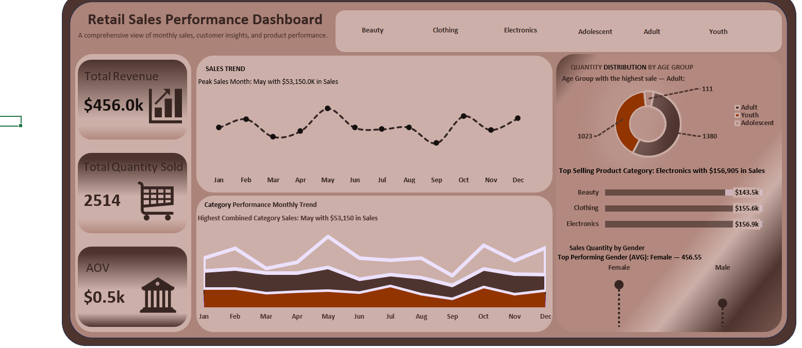

# Retail Sales Performance Dashboard

## 📖 Table of Contents
- [Project Overview](#project-overview)
- [Business Problem](#business-problem)
- [Dataset Description](#dataset-description)
- [Data Cleaning / Preparation](#data-cleaning--preparation)
- [Exploratory Data Analysis (EDA)](#exploratory-data-analysis-eda)
- [Data Analysis](#data-analysis)
- [Key Insights](#key-insights)
- [Dashboard Overview](#dashboard-overview)
- [Tools & Technologies](#tools--technologies)
- [Dashboard Preview](#dashboard-preview)
- [Recommendations](#recommendations)
- [Limitations](#limitations)
- [Author](#author)

---
## Project Overview
This project focuses on analyzing retail sales data to understand sales performance, customer behavior, and product category trends.  
The goal was to transform raw sales data into meaningful insights that support business decision-making.

The analysis was carried out using **SQL for querying and analysis**, **Power Query in Excel for data cleaning**, and **Excel for building an interactive dashboard**.

---

## Business Problem
Retail businesses need to understand:
- Which product categories generate the most revenue
- How sales perform across different months
- Which customer segments contribute most to sales
- Overall sales performance using key metrics

This project answers these questions using data analysis and visualization.

---

## Dataset Description
The dataset contains retail transaction records including:
- Transaction date
- Product category (Beauty, Clothing, Electronics)
- Quantity sold
- Revenue
- Customer age group (Youth, Adolescent, Adult)
- Customer gender

> **Note:** The raw dataset was cleaned and transformed before analysis.

---

## Data Cleaning / Preparation
Data cleaning was performed using **Power Query** in Excel.  
The Key cleaning steps includes:
- Removing duplicate records
- Handling missing and inconsistent values
- Standardizing column names and data types
- Creating calculated columns for analysis
- Ensuring data accuracy and consistency

The cleaned dataset was saved and used for further analysis.

---

## Exploratory Data Analysis (EDA)
EDA was conducted to understand sales patterns, customer behavior, and product performance.  
Key questions explored included:
- How do sales vary across months?
- Which product categories generate the most revenue?
- Which customer age group contributes most to sales?
- Are there noticeable seasonal trends?
- How does sales performance differ by gender?

## Data Analysis
SQL and Excel were used to answer the EDA questions through:
- Aggregation and grouping of sales data
- Revenue and quantity calculations
- Trend analysis across time
- Category and demographic comparisons

SQL queries used for this analysis can be found in the `sql/` folder.

---

## Key Insights
- **Total Revenue:** $456,000+
- **Peak Sales Month:** May ($53,150)
- **Lowest Sales Month:** September ($23.6k)
- **Top Product Category:** Electronics ($156,905)
- **Highest Contributing Age Group:** Adult
- **Top Performing Gender (Average Sales):** Female
- Sales show noticeable seasonal trends across months

---

## Dashboard Overview
An interactive Excel dashboard was created to visualize the insights, featuring:
- KPI cards (Total Revenue, Total Quantity Sold, AOV)
- Monthly sales trend line chart
- Category performance trend
- Sales distribution by age group
- Sales performance by gender
- Interactive slicers for filtering by category and age group

---

## Tools & Technologies
- SQL (Data Analysis)
- Microsoft Excel
  - Power Query
  - Pivot Tables
  - Charts & Slicers

---

## Dashboard Preview

---

## Recommendations
- Focus marketing efforts on **Electronics** during peak months.  
- Target **Adult customers** for promotions and loyalty programs.  
- Investigate why sales are lower in certain months and explore seasonal campaigns.  
- Consider gender-targeted promotions, especially to female customers.  

---

## Limitations
- Dataset is limited to recorded transactions; offline or untracked sales are not included.  
- Customer demographics are limited to age group and gender—more detailed segmentation could improve insights.  
- Dashboard is built in Excel; large datasets may require more advanced tools for performance.  

---

## Author
**Sandra Solomon**

